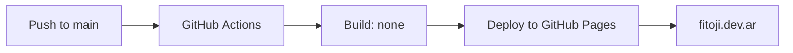

# 🌐 Portfolio Fitoji

> **Sitio estático vanilla** — HTML/CSS/JS sin build tools, frameworks ni dependencias. Deploy automático en **fitoji.dev.ar** vía GitHub Pages.

---

## 🚀 Quick Start

```bash
# Sin instalación — abre directo en el navegador
open index.html

# O con cualquier static server
npx serve .
# python3 -m http.server
# php -S localhost:8000
```

---

## 📁 Estructura del Proyecto

| Archivo/Carpeta | Propósito |
|----------------|-----------|
| `index.html` | Entrypoint único — single page |
| `main.js` | Interacciones, theme toggle, scroll-reveal |
| `style.css` | Variables CSS, light/dark mode, grid responsivo |
| `CNAME` | Dominio personalizado `fitoji.dev.ar` |
| `img/` | Assets estáticos |
| `img/svgs/` | Iconos tech (sin fondo, solo marca de color) |
| `.atl/` | Skill registry OpenCode |

---

## ✨ Características

| Feature | Implementación |
|---------|---------------|
| 🌗 **Tema dual** | `localStorage` persistencia + `data-theme` attribute |
| 🎞 **Animaciones** | Scroll-reveal CSS (`.reveal-slide-left`, `.reveal-slide-right`, `.reveal-scale`) |
| 📱 **Responsive** | Mobile-first, breakpoints 768px / 1024px |
| 🏷 **Tags tech** | Fondo neutro unificado + shadow + iconos SVG con colores de marca |
| ⚡ **Performance** | Sin build step, fonts CDN, lazy-loading images |

---

## 🛠 Stack Tecnológico


**Fuentes:** `Inter` (UI) + `Rubik` (Headings) vía CDN

---

## 📦 Proyectos Destacados

| # | Proyecto | Stack | Descripción |
|---|----------|-------|-------------|
| 1 | **Visor Json Tests** | React + JS | Cargar cuestionarios JSON y practicar interactivamente |
| 2 | **Aneka** | Astro + JS | Sitio e-commerce garrapiñadas |
| 3 | **Gestión Nutricional** | Next.js + TS + Tailwind + SQLite (browser) | Dietas, calorías Harris-Benedict/Mifflin-St Jeor, IA |
| 4 | **Romina Melul** | HTML/CSS + JS | Web terapeuta + reservas + contenido audiovisual |
| 5 | **VipaBase** | Next.js + TS + Tailwind + Neon DB | Registro personal de cursos de meditación Vipassana |

> Grid responsivo: **máx. 3 columnas** en desktop → 2 en tablet → 1 en mobile

---

## 🎨 Diseño & UX

### Tema Oscuro/Claro
```js
// main.js — toggle simple persistido
const theme = localStorage.getItem('darkMode') === 'true';
document.documentElement.dataset.theme = theme ? 'dark' : 'light';
```

### Variables CSS (extracto)
```css
:root {
  --color-primary-500: #8b5cf6;   /* violet */
  --color-gray-100: #f3f4f6;      /* tags light */
  --color-gray-800: #1f2937;      /* tags dark */
  --shadow-md: 0 4px 6px -1px rgba(0,0,0,0.1);
  --radius-full: 9999px;
}
```

### Animaciones Scroll-Reveal
```css
.reveal-item { opacity: 0; transform: translateY(20px); transition: all 0.6s ease; }
.reveal-item.visible { opacity: 1; transform: none; }
```

---

## 🚢 Deploy



**Zero config** — GitHub Pages sirve `index.html` directo desde `main`.

---

## 📋 Checklist de Calidad

- [ ] ✅ HTML semántico válido
- [ ] ✅ CSS sin `!important` (salvo overrides de tema)
- [ ] ✅ JS vanilla ES6+ sin transpilar
- [ ] ✅ Imágenes optimizadas (WebP, lazy-loading)
- [ ] ✅ Contraste WCAG AA en ambos temas
- [ ] ✅ Navegación por teclado funcional
- [ ] ✅ `meta viewport` + `theme-color` configurados

---

## 🔗 Enlaces

| Enlace | Descripción |
|--------|-------------|
| 🌐 **Live** | [fitoji.dev.ar](https://fitoji.dev.ar) |
| 📂 **Repo** | [github.com/fitoji/portfolioFitoji](https://github.com/fitoji/portfolioFitoji) |
| 🐛 **Issues** | [Reportar bug](https://github.com/fitoji/portfolioFitoji/issues) |

---

## 📄 Licencia

MIT — Úsalo, modifícalo, compártelo.

---

> *Hecho con café ☕ y curiosidad por Fitoji*